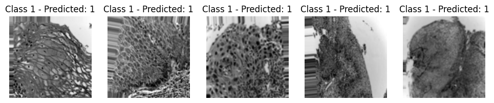
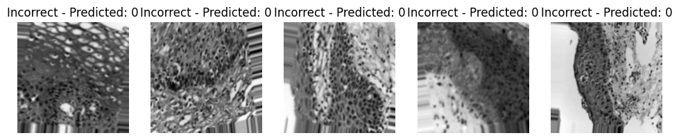

<a name="readme-top"></a>


<!-- PROJECT LOGO -->
<br />
<div align="center">
  <a href="">
    
  </a>

<h3 align="center">Data Science in Health project (Oral Cancer image classification)</h3>

  <p align="center">
    This project is about classify oral cancer by using image classification with various techniques and implementing our own CNN model.
    <br />
    
  </p>
</div>


<!-- TABLE OF CONTENTS -->
<details>
  <summary>Table of Contents</summary>
  <ol>
    <li>
      <a href="#about-the-project">About The Project</a>
      <ul>
        <li><a href="#built-with">Built With</a></li>
      </ul>
    </li>
    <li>
      <a href="#getting-started">Getting Started</a>
      <ul>
        <li><a href="#prerequisites">Prerequisites</a></li>
        <li><a href="#installation">Installation</a></li>
      </ul>
    </li>
    <li><a href="#usage">Usage</a></li>
    <li><a href="#roadmap">Roadmap</a></li>
    <li><a href="#contributing">Contributing</a></li>
    <li><a href="#license">License</a></li>
    <li><a href="#contact">Contact</a></li>
    <li><a href="#acknowledgments">Acknowledgments</a></li>
  </ol>
</details>


[![Product Name Screen Shot][product-screenshot]]
<!-- ABOUT THE PROJECT -->
## About The Project


In this section, we create a function for transforming all of images by resizing to 224x224 pixels, converting to grayscale, converting image to pytorch tensor, and making GaussianBlur into the images.


The dataset contains 2 types of patience including normal and squamous cell carcinoma. We split both of them into 2 folders which are train and test set with 30% on the test set. Then we also split data again into train and validation set with the selection of 30%.


This will be an example of the images that applied transforming into them.


This is our test CNN model that was applied for training.


Now we calculate validation loss by using cross-entropy function, SGD as optimizer, and lr scheduler for reducing learning rate. In our project, we got the best validation loss as 0.589 and train loss as 0.3039.


After we got the result of the loss for train and validation set, we now can plot the loss and the learning rate with log scale.


Then finally we used test images to predict the correct class which we got accuracy of the network on the test images at 68%.

This confusion matrix display the amount of images that the model can predict their classes correct and incorrect, we can see that both class have half way more than incorrect prediction which could consider as a good result since the model was crafted from scratch.





Lastly, we displayed the images for each class that was predicted correctly and incorrectly.

<p align="right">(<a href="#readme-top">back to top</a>)</p>


### Installation

1. Clone the repo
   ```sh
   git clone https://github.com/dgNathiRocha/datascienceHealth.git
   ```
2. Install all libraries
 - Matplotlib
 - Torch
 - Time
 - Numpy
 - SkLearn
 - Torvhvision

<p align="right">(<a href="#readme-top">back to top</a>)</p>


<!-- USAGE EXAMPLES -->
## Usage

This project aim to classify accurate as much as possible but in the end, the crucial part is about understanding the process of the workflow.

<p align="right">(<a href="#readme-top">back to top</a>)</p>


<!-- LICENSE -->
## License

Distributed under the MIT License. See `LICENSE.txt` for more information.

<p align="right">(<a href="#readme-top">back to top</a>)</p>


