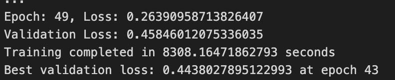

<a name="readme-top"></a>


<!-- PROJECT LOGO -->
<br />
<div align="center">
  <a href="">
    
  </a>

<h3 align="center">Data Science in Health project (Oral Cancer image classification)</h3>

  <p align="center">
    This project is about classify oral cancer by using image classification with various techniques and implementing our own CNN model. The final files that we used for describing the information are "oralcancer_final.ipynb" & "oralcancer_final".ipynb.
    <br />
    
  </p>
</div>


<!-- ABOUT THE PROJECT -->
## About The Project

### Oral cancer is causes from tobacco and alcohol consumption. Other risk factors can include: human papillomavirus (HPV) epstein-barr virus (EBV). It can occur in all part of your mouth. There is a cell called squamous cell carcinoma(SCC) which is a type of skin cancer that can grow large or spread to other parts of the body. Below will be an example images of normal cell and SCC cell:
<table>
  <tr>
    <td align="center">
      <br>
      Normal cell
    </td>
    <td align="center">
      <br>
      Squamous Cell Carcinoma
    </td>
  </tr>
</table>


From the images, we can see that the normal sample shows a small size of epithelium, whereas the OSCC sample shows large size of squamous epithelium.


<!-- Walk through the code  -->
## Walk through the code
We firstly splitted into 70% of train set and 30% of train set for both classes.
```! pip install python_splitter
import python_splitter
python_splitter.split_from_folder("/tmp/Oral Cancer", train=0.7, test=0.3)
   ```
--- 

Then we create a function for transforming all of images by resizing to 224x224 pixels, and converting image to pytorch tensor.
```img_dim = 224
image_transform = torchvision.transforms.Compose([
    torchvision.transforms.Resize((img_dim, img_dim)), # Resize the image to 224x224
    torchvision.transforms.ToTensor() # Convert the image to a pytorch tensor
])
```

---

After that we check the number of samples in the train and test dataset which there are 7000 images in the train set and 3002 images in the test set.


---

Now we splitted data into train and and validation set randomly from 70% train set that we already splitted. We will have 4900 images in the new train set, 2100 images in the validation set, and 3002 images in the test set.


---

We now check the distribution of the classes in the original dataset. We can see that they have same amount of images for both classes. So we decided not to do under/oversampling in this case.


---

This will be an example of the image.


--- 

Below is our implemented CNN model that was applied for training.
```
import torch.nn as nn # basic building block for neural networks
import torch.nn.functional as F # import convolution functions like Relu

class testmodel(nn.Module):

  def __init__(self, num_classes=2):
    super(testmodel, self).__init__()

       # convolutional layer 1 & max pool layer 1
    self.layer1 = nn.Sequential(
        nn.Conv2d(3, 32, kernel_size=3),
        nn.ReLU(),
        nn.MaxPool2d(kernel_size=2))

    # convolutional layer 2 & max pool layer 2
    self.layer2 = nn.Sequential(
        nn.Conv2d(32, 64, kernel_size=4),
        nn.ReLU(),
        nn.MaxPool2d(kernel_size=2),
        nn.Dropout(0.2))

    self.layer3 = nn.Sequential(
        nn.Conv2d(64, 128, kernel_size=4),
        nn.ReLU(),
        nn.MaxPool2d(kernel_size=2),
        nn.Dropout(0.2))

    self.layer4 = nn.Sequential(
        nn.Conv2d(128, 256, kernel_size=4),
        nn.ReLU(),
        nn.MaxPool2d(kernel_size=2),
        nn.Dropout(0.2))

    self.layer5 = nn.Sequential(
        nn.Conv2d(256, 256, kernel_size=4),
        nn.ReLU(),
        nn.MaxPool2d(kernel_size=2),
        nn.Dropout(0.2))


    #Fully connected layer
    self.fc = nn.Sequential(
        nn.Linear(256*4*4, num_classes),

    )
  # Feed forward the network
  def forward(self, x):
      out = self.layer1(x)
      out = self.layer2(out)
      out = self.layer3(out)
      out = self.layer4(out)
      out = self.layer5(out)
      out = out.reshape(out.size(0), -1)
      out = self.fc(out)
      return out
```

---

Now we calculate validation loss by using cross-entropy function, SGD as optimizer, and lr scheduler for reducing learning rate. In our project, we got the best validation loss as 0.44 and train loss as 0.26.


---

### Training and Validation Loss

The graph illustrates the training and validation loss over 50 epochs. Key observations are:

- **Training Loss** decreases steadily, reflecting the model's improving performance on the training dataset.
- **Validation Loss** initially fluctuates and stabilizes after 20 epochs, with the best model marked at epoch 43, beyond which slight overfitting is observed.
- The red dashed line denotes the epoch where the best model (lowest validation loss) was identified.


### Learning Rate Schedule

The learning rate schedule graph shows the adjustment strategy used during training:

- The learning rate starts at above \(10^{-3}\) and is systematically reduced at certain epochs.
- This stepwise reduction strategy helps in fine-tuning the model as training progresses, with the final learning rate reaching \(10^{-8}\).


--- 
### Confusion Matrix (Implemeted model)
Then finally we used test images to predict the correct class which we got accuracy of the network on the test images at 79%.

This confusion matrix display the amount of images that the model can predict their classes correct and incorrect, we can see that both class have half way more than incorrect prediction which could consider as a good result since the model was crafted from scratch.

  

---

Lastly, we displayed the images for each class that was predicted correctly and incorrectly.


---

### Compare with ImageNet

We also additionally did the image classification by using ImageNet as a based model. We did all the processes the same as we did with the implemented model. Here are some example of graphs that show the performance of ImageNet in image classification.


## Training and Validation Loss

The graph below illustrates the training and validation loss over 50 epochs.


Key observations are:

- **Training Loss** remains almost constant throughout the epochs, indicating no significant learning or improvement on the training data.
- **Validation Loss** also remains almost constant and overlaps with the training loss, suggesting no improvement in the model's generalization ability.
- The red dashed line at epoch 19 marks the point where the best model was identified, but given the constant nature of the loss curves, this selection is arbitrary.

---

## Confusion Matrix (ImageNet)
We used test images to predict the correct class which we got accuracy of the network on the test images just only 49% which might due to different factors such as learning rate, complexity of the model.


<p align="right">(<a href="#readme-top">back to top</a>)</p>


### Installation

1. Clone the repo
   ```sh
   git clone https://github.com/dgNathiRocha/datascienceHealth.git
   ```
2. Install all libraries
 - Matplotlib
 - Torch
 - Time
 - Numpy
 - SkLearn
 - Torvhvision

<p align="right">(<a href="#readme-top">back to top</a>)</p>


<!-- USAGE EXAMPLES -->
## Usage

This project aim to classify accurate as much as possible but in the end, the crucial part is about understanding the process of the workflow.

<p align="right">(<a href="#readme-top">back to top</a>)</p>


<!-- LICENSE -->
## License

Distributed under the MIT License. See `LICENSE.txt` for more information.

<p align="right">(<a href="#readme-top">back to top</a>)</p>


